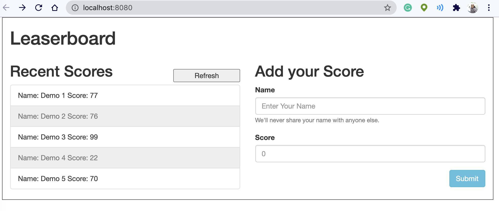

# Leaderboard

Simple Application that shows peoples schools in a Leaderboard format

## Built With

- HTML, JavaScript & CSS

## Instalation

To get a local copy up and running follow these simple example steps.

- Open terminal
- Clone this project
- cd Leaderboard
- npm install
- npm run start

### Prerequisites

- IDE to edit and run the code (We've used Visual Studio Code 🔥).

### Usage

- For anyone who wants to practice HTML5 and JavaScript.
- Webpack and Api Calls with
- Classes and construct practices.

## Authors

👤 **ThankGod Richard**

- GitHub: [@githubhandle](https://github.com/thankgodr)
- LinkedIn: [LinkedIn](http://www.linkedin.com/in/thankgodr)

## Show your support

Give a ⭐️ if you like this project!
